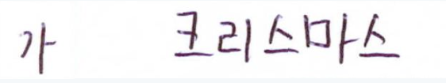
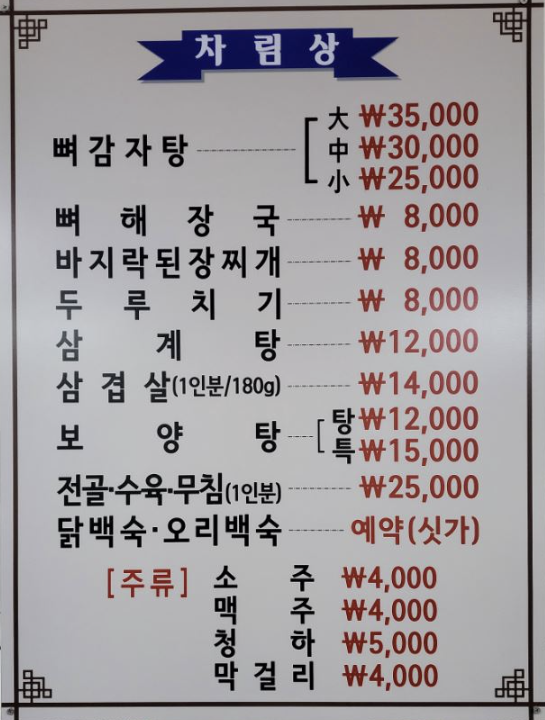
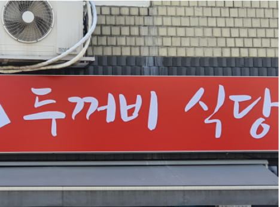

# VisionAI

----
## 프로젝트 개요

Computer Vision Task : 원하는 주제를 선정해, 주제에 맞는 데이터를 탐색해 전처리 후 모델학습 및 평가

OCR Task의 text detection 및 text recognition 중 text recognition을 주제로, 한국어 text 데이터셋으로 모델 학습 및 평가 진행

사용한 모델 : ClovaAI의 [deep-text-recognition-benchmark](https://github.com/clovaai/deep-text-recognition-benchmark)


사용한 데이터셋 : AI HUB의 한국어 메뉴판, 손글씨, wild text 데이터

사용한 팀원 : 임형빈, 배지환, 류병하

[최종 발표 자료](https://github.com/Hyungson/VisionAI/blob/main/%E1%84%87%E1%85%B5%E1%84%8C%E1%85%A5%E1%86%ABAI_%E1%84%8B%E1%85%B5%E1%86%B7%E1%84%92%E1%85%A7%E1%86%BC%E1%84%87%E1%85%B5%E1%86%AB%2B%E1%84%87%E1%85%A2%E1%84%8C%E1%85%B5%E1%84%92%E1%85%AA%E1%86%AB%2B%E1%84%85%E1%85%B2%E1%84%87%E1%85%A7%E1%86%BC%E1%84%92%E1%85%A1_%E1%84%8E%E1%85%AC%E1%84%8C%E1%85%A9%E1%86%BC%E1%84%87%E1%85%A1%E1%86%AF%E1%84%91%E1%85%AD.pdf)

----
## 데이터 탐색 및 전처리

| 데이터셋 명 | 예시 이미지 |
| --- | --- | 
| 다양한 형태의 한글 문자 OCR |  | 
| 야외 실제 촬영 한글이미지 |  | 
| 관광음식메뉴판 데이터 | | 

각 데이터셋마다 특징이 달라서 따로 전처리를 진행했다.


이질적인 데이터셋을 shuffle해서 사용해 일반화 성능을 높이고자 했다.


모델에 필요한 데이터셋 형태는 텍스트 bbox를 폴더에 따로 저장하고, 각 bbox에 맞는 라벨 값을 한 txt 파일에 저장하는 형태


이미지에 해당하는 annotation 값에서 bbox 좌표를 이용해 영역을 자르고 이에 해당하는 라벨을 저장했다.


AI HUB 데이터셋이 완벽하진 않아서 좌표가 0이거나 음수인 것을 예외처리로 제거했으며, bbox 좌표 영역에 텍스트가 존재하지 않는 경우도 더러 존재했다.


디버깅으로 걸러주는 과정이 있었다. 이후 lmdb 데이터셋 형태로 변경해주었다.


train, validation, test는 각각 0.7, 0.15, 0.15 비율로 산정했으며 각 데이터셋 당 10만개의 데이터 총 30만개의 데이터를 사용했다.

----
## 모델

deep-text-recognition은 Transformation, FeatureExtraction, SequenceModeling, Prediction 부분에서 여러 모듈을 사용할 수 있는 멀티 모듈 기능이 있었다. 


여러 조합으로 학습을 진행해 basemodel을 산정하고, text recognition task 성능을 향상시킬 수 있는 parameter를 변경해가며 학습을 진행하고자 했다.

----
## 모델과 데이터 준비

Linux 환경의 pytorch 2.0, python 3.8, cuda 11.1 GPU num 1 의 환경으로 학습을 진행했다.
```
pip3 install lmdb pillow torch vision nltk natsort opencv-python fire
```
모델 git clone
```
git clone https://github.com/clovaai/deep-text-recognition-benchmark.git
```
전처리가 완료된 dataset의 형태는 다음과 같다.
```
data
├── gt.txt
└── test
    ├── word_1.png
    ├── word_2.png
    ├── word_3.png
    └── ...
```
이때, 'gt.txt'파일은 다음과 같은 구조이다.
```
test/word_1.png Tiredness
test/word_2.png kills
test/word_3.png A
...
```
모델 폴더 안에 data_lmdb 폴더를 만들고 전처리한 데이터를 lmdb형태로 변환해준다.
```
python3 create_lmdb_dataset.py --inputPath data/test --gtFile data/test/test_gt.txt --outputPath data_lmdb/test
```

----
## 학습 진행 전 요구사항

데이터 폴더 경로와, 파라미터를 지정해 학습을 진행한다. 


train.py에서 기존 사항에 변경할 점이 있었다. 
1. 기존 모델은 한국어 데이터셋이 아닌 영어 데이터셋이었으므로 이에 맞게 변경했다.
```
parser.add_argument('--character', type=str,
                        default='0123456789abcdefghijklmnopqrstuvwxyz가각간갇갈감갑값갓강갖같갚갛개객걀걔거걱건걷걸검겁것겉게겨격겪견결겹경곁계고곡곤곧골곰곱곳공과관광괜괴굉교구국군굳굴굵굶굽궁권귀귓규균귤그극근글긁금급긋긍기긴길김깅깊까깍깎깐깔깜깝깡깥깨꺼꺾껌껍껏껑께껴꼬꼭꼴꼼꼽꽂꽃꽉꽤꾸꾼꿀꿈뀌끄끈끊끌끓끔끗끝끼낌나낙낚난날낡남납낫낭낮낯낱낳내냄냇냉냐냥너넉넌널넓넘넣네넥넷녀녁년념녕노녹논놀놈농높놓놔뇌뇨누눈눕뉘뉴늄느늑는늘늙능늦늬니닐님다닥닦단닫달닭닮담답닷당닿대댁댐댓더덕던덜덟덤덥덧덩덮데델도독돈돌돕돗동돼되된두둑둘둠둡둥뒤뒷드득든듣들듬듭듯등디딩딪따딱딴딸땀땅때땜떠떡떤떨떻떼또똑뚜뚫뚱뛰뜨뜩뜯뜰뜻띄라락란람랍랑랗래랜램랫략량러럭런럴럼럽럿렁렇레렉렌려력련렬렵령례로록론롬롭롯료루룩룹룻뤄류륙률륭르른름릇릎리릭린림립릿링마막만많말맑맘맙맛망맞맡맣매맥맨맵맺머먹먼멀멈멋멍멎메멘멩며면멸명몇모목몬몰몸몹못몽묘무묵묶문묻물뭄뭇뭐뭘뭣므미민믿밀밉밌및밑바박밖반받발밝밟밤밥방밭배백뱀뱃뱉버번벌범법벗베벤벨벼벽변별볍병볕보복볶본볼봄봇봉뵈뵙부북분불붉붐붓붕붙뷰브븐블비빌빔빗빚빛빠빡빨빵빼뺏뺨뻐뻔뻗뼈뼉뽑뿌뿐쁘쁨사삭산살삶삼삿상새색샌생샤서석섞선설섬섭섯성세섹센셈셋셔션소속손솔솜솟송솥쇄쇠쇼수숙순숟술숨숫숭숲쉬쉰쉽슈스슨슬슴습슷승시식신싣실싫심십싯싱싶싸싹싼쌀쌍쌓써썩썰썹쎄쏘쏟쑤쓰쓴쓸씀씌씨씩씬씹씻아악안앉않알앓암압앗앙앞애액앨야약얀얄얇양얕얗얘어억언얹얻얼엄업없엇엉엊엌엎에엔엘여역연열엷염엽엿영옆예옛오옥온올옮옳옷옹와완왕왜왠외왼요욕용우욱운울움웃웅워원월웨웬위윗유육율으윽은을음응의이익인일읽잃임입잇있잊잎자작잔잖잘잠잡잣장잦재쟁쟤저적전절젊점접젓정젖제젠젯져조족존졸좀좁종좋좌죄주죽준줄줌줍중쥐즈즉즌즐즘증지직진질짐집짓징짙짚짜짝짧째쨌쩌쩍쩐쩔쩜쪽쫓쭈쭉찌찍찢차착찬찮찰참찻창찾채책챔챙처척천철첩첫청체쳐초촉촌촛총촬최추축춘출춤춥춧충취츠측츰층치칙친칠침칫칭카칸칼캄캐캠커컨컬컴컵컷케켓켜코콘콜콤콩쾌쿄쿠퀴크큰클큼키킬타탁탄탈탑탓탕태택탤터턱턴털텅테텍텔템토톤톨톱통퇴투툴툼퉁튀튜트특튼튿틀틈티틱팀팅파팎판팔팝패팩팬퍼퍽페펜펴편펼평폐포폭폰표푸푹풀품풍퓨프플픔피픽필핏핑하학한할함합항해핵핸햄햇행향허헌험헤헬혀현혈협형혜호혹혼홀홈홉홍화확환활황회획횟횡효후훈훌훔훨휘휴흉흐흑흔흘흙흡흥흩희흰히힘?!', help='character label')
```
2. 3개의 데이터셋을 한 폴더에 넣어 shuffle을 사용했으므로 select_data와 bath_ratio를 변경했다.
```
parser.add_argument('--select_data', type=str, default='/',
                        help='select training data (default is MJ-ST, which means MJ and ST used as training data)')
parser.add_argument('--batch_ratio', type=str, default='1',
                        help='assign ratio for each selected data in the batch')
```


3. 학습 iteration은 default가 30만이었고, Loss와 Acc를 시각화해보며 점차 줄였다.


iteration이 5만 이후로는 변화가 미비했고 시간 상 5만으로 이후 실험을 진행했다.
```
CUDA_VISIBLE_DEVICES=0 python3 train.py --train_data /home/work/Vision/1205_lmdb/train --valid_data /home/work/Vision/1205_lmdb/val \
	--Transformation TPS --FeatureExtraction RCNN --SequenceModeling BiLSTM --Prediction CTC \
 --workers 0 --num_iter 50000
```


----
## 학습 진행
---
#### 각자 데이터로 인퍼런스
본격적인 진행에 앞서, 각각의 데이터셋으로 학습을 진행해보았다. 데이터셋에 문제는 없는지, 코드에 문제가 없는지 파악하기 위한 인퍼런스였다.

1. train loss
   


2. valid loss
   


3. acc
   


yim : menu data / bae : handwritten data / ryu : wildtext data

메뉴판 데이터와 야외 텍스트 데이터 난이도가 더 높았다. 손글씨 데이터는 데이터들이 깔끔하고 이외 데이터는 왜곡이 심했고 깔끔하지 못했다.

---
#### 합쳐진 데이터로 베이스 모델 서치

프로젝트 마감 시간 상 여러 조합을 시도해보진 못했다. 
각자 데이터셋으로 실험을 해보며, Transformation과 SequenceModeling, Prediction은 각각 TPS/BiLSTM/CTC가 성능이 우수하게 나왔기 때문에 이를 고정했다.
FeatureExtraction의 세 모듈로 베이스 모델 실험을 진행했다.

1. train loss


2. valid loss


3. acc


---
***TPS RCNN BiLSTM CTC로 베이스 모델 선정***

---

#### imgW, imgH, batch size, hidden size, optimizer parameter tuning 시도
1. imgW, imgH를 높여 이미지 해상도를 높여 성능 향상 도모
2. batch size를 높이거나 줄여 과적합 방지 및 컴퓨팅 파워 향상
3. hidden size 높여 과적합 방지
4. defualt optimizer인 ada delta parameter tuning

---
1. train loss


2. valid loss


3. acc


4. test acc


----
## 최종 선정 모델

***최종 선정 모델 : TPS RCNN BiLSTM CTC imgH imgW 1.25배 증가***

imgH, imgW를 2배, 1.5배, 1.25배를 시도했지만 2배와 1.5배는 컴퓨팅파워 문제로 에러가 발생했다.

1.25배로 진행했을 때 학습이 진행되었고 결과가 가장 좋았다.

1. train, valid loss


2. acc


자세한 사항은 -> [최종 발표 자료](https://github.com/Hyungson/VisionAI/blob/main/%E1%84%87%E1%85%B5%E1%84%8C%E1%85%A5%E1%86%ABAI_%E1%84%8B%E1%85%B5%E1%86%B7%E1%84%92%E1%85%A7%E1%86%BC%E1%84%87%E1%85%B5%E1%86%AB%2B%E1%84%87%E1%85%A2%E1%84%8C%E1%85%B5%E1%84%92%E1%85%AA%E1%86%AB%2B%E1%84%85%E1%85%B2%E1%84%87%E1%85%A7%E1%86%BC%E1%84%92%E1%85%A1_%E1%84%8E%E1%85%AC%E1%84%8C%E1%85%A9%E1%86%BC%E1%84%87%E1%85%A1%E1%86%AF%E1%84%91%E1%85%AD.pdf)

----
## 인사이트

1. 시간 상 더 많은 조합을 실험해보지 못한 것이 아쉬웠다.

2. 모델은 잘못이 없다. 데이터가 문제일 뿐.
wild, menu data에 ocr에 수월하도록 증강 기법을 더 시도했으면 성능이 더 좋았을 것으로 기대된다.

3. text detection 과정을 앞서 추가해 OCR task를 진행해보고자 한다.
